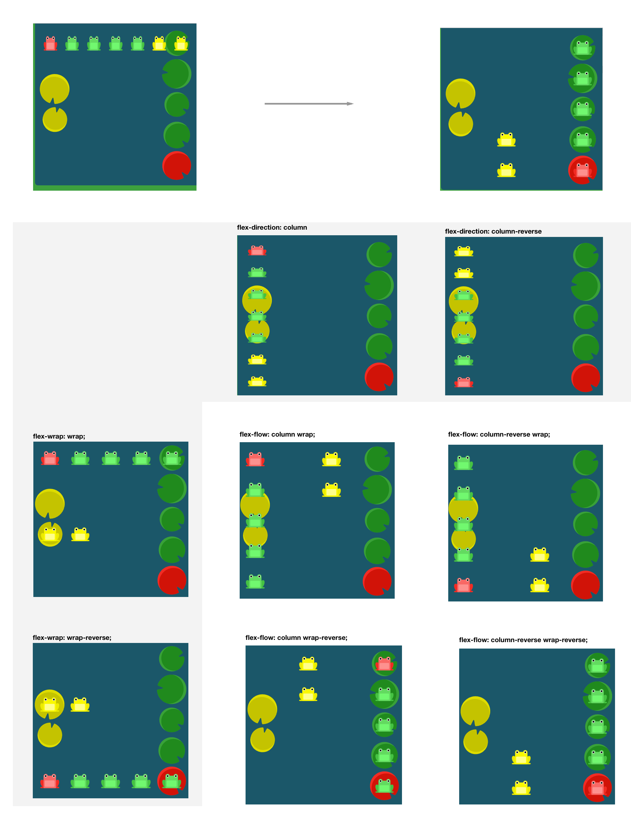

# Flexbox

#### What is it?
It's a container used to layout items. We used to use `float` to layout.

#### Do I still need to use `max-width`?
Yes.

#### How to use it ot replace bootstrap?
- For `col-md-3`, use percentage: `flex-basis: 25%`.
- For `pull` or `push`, use `order: n` (by default is 0, 1 will move the item on main axis)
- For `visible-xs`, use CSS `display:none` on different breakpoints. Note this has nothing to do with Flexbox

## Notes
Use this as reference: https://css-tricks.com/snippets/css/a-guide-to-flexbox/

#### Container
- `display: flex`
- `flex-direction`
  - Notice that when you set the direction to a reversed row or column, start and end are also reversed. `1 2 3 -> (row-reversed) 3 2 1` So you can use this to **reverse item orders on main axis**.
- `flex-wrap` (by default, all fit to one line)
  - there is an option `wrap-reverse`: flex items will wrap onto multiple lines from bottom to top. Which will basically **move items on cross axis**. See flexbox foggy level 24.
- `flex-flow` = `flex-direction | flex-wrap`
  - so you can just use this one to reorder items on both main and cross axis
- 2 axis:
  - main: `justify-content`
    - Note when `center` and `wrap`, only the wrapped items in next line will be centered.
  - cross:
    - `align-items`
      - it determines how the items **as a whole** are aligned within the container
      - interesting options: baseline, stretch 
    - `align-content` (when there is more space/multiple lines on cross axis)
      - it determines the spacing between lines

#### Children
- `order` (default: 0) 
  - use to **'move' on main axis**. For example, you can use `order: -1` to achive bootstrap `col-md-pull-3`
- `align-self`: this override the defalut `align-items` in container.
  - use to **'move' on cross axis**
  - NOTE to vertical align this item, you don't need to add `flex` and `align-items` to the item, you could just use `align-self` on the item.
- `flex-grow` (default: 0)
  - the number means how many propotion of **AVAILABLE** container space it can get. So one with 1 and one with 2 will get 1/3 and 2/3 space to grow.
- `flex-shrink` (default: 1)
  - 0 means no shrink. Default 1 means everyone shrinks the same.
- `flex-basis` (default: auto)
  - 'auto' keyword means "look at my width or height property" (which was temporarily done by the main-size keyword until deprecated). 
- `flex` = `grow | shrink | basis` (default: 0 1 auto)

Example on flex:
```css
.item1{ flex: 2 0 50px} 
.item2{flex: 0 0 150px}
.item3{flex: 1 0 50px}` 

// if they take the whole container 600px, it'll ends up with this:
// item 1: (600 - 50 - 150 - 50) / (2+1) * 2 + 50 = 250px
// | item 1 250px | item 2 150px | item 3 15opx |
```

NOTE: float, clear and vertical-align have no effect on a flex item.


## Other resources
- practice: https://flexboxfroggy.com/

Froggy level 24:

