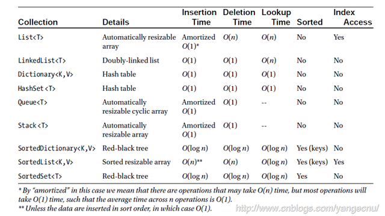
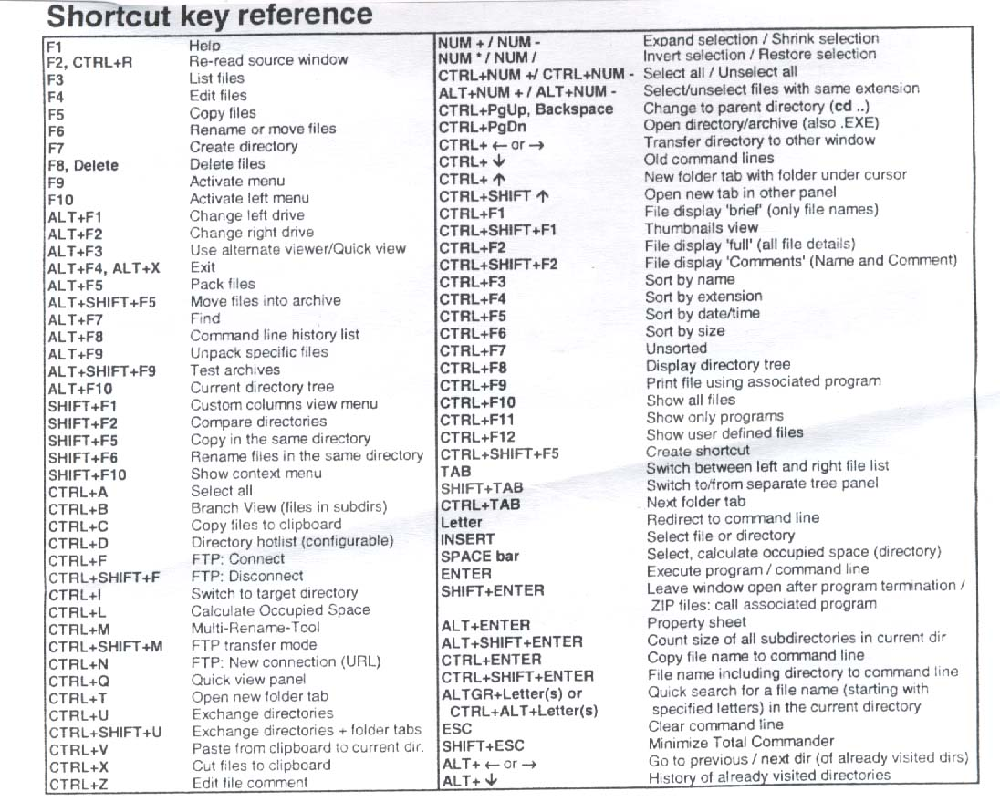

A collection of cheatsheets.

- [Font Awesome](https://fortawesome.github.io/Font-Awesome/cheatsheet/)
- [SemVer calculator](http://semver.npmjs.com/)
- [Roadmap to becoming a web developer in 2017](https://github.com/kamranahmedse/developer-roadmap#-front-end-roadmap)

## ASCII

## BigO

http://bigocheatsheet.com/

## VIM

## .Net
[Core .Net PDF](core_dotnet.pdf)

## Total Commander

