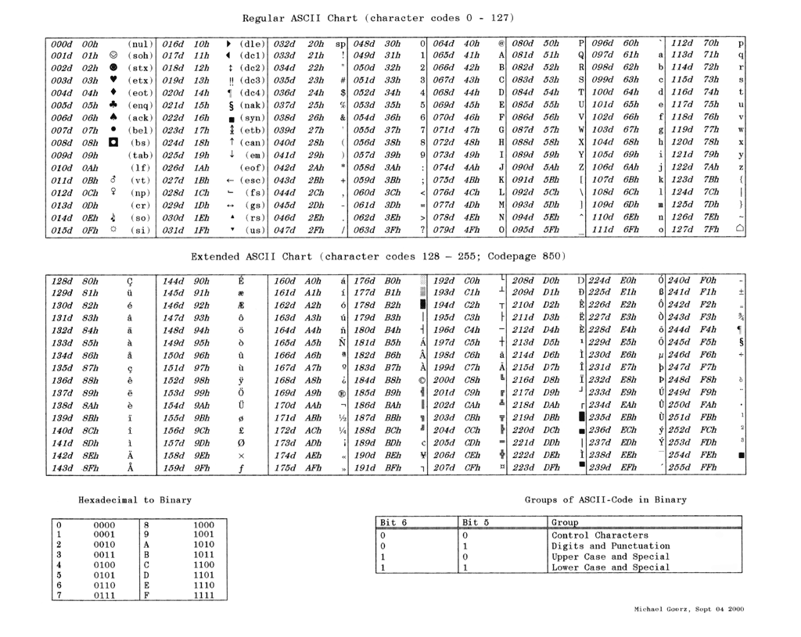
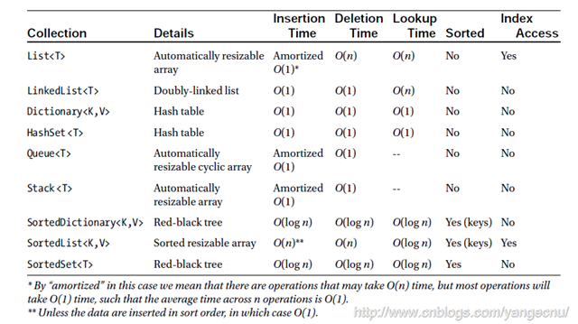
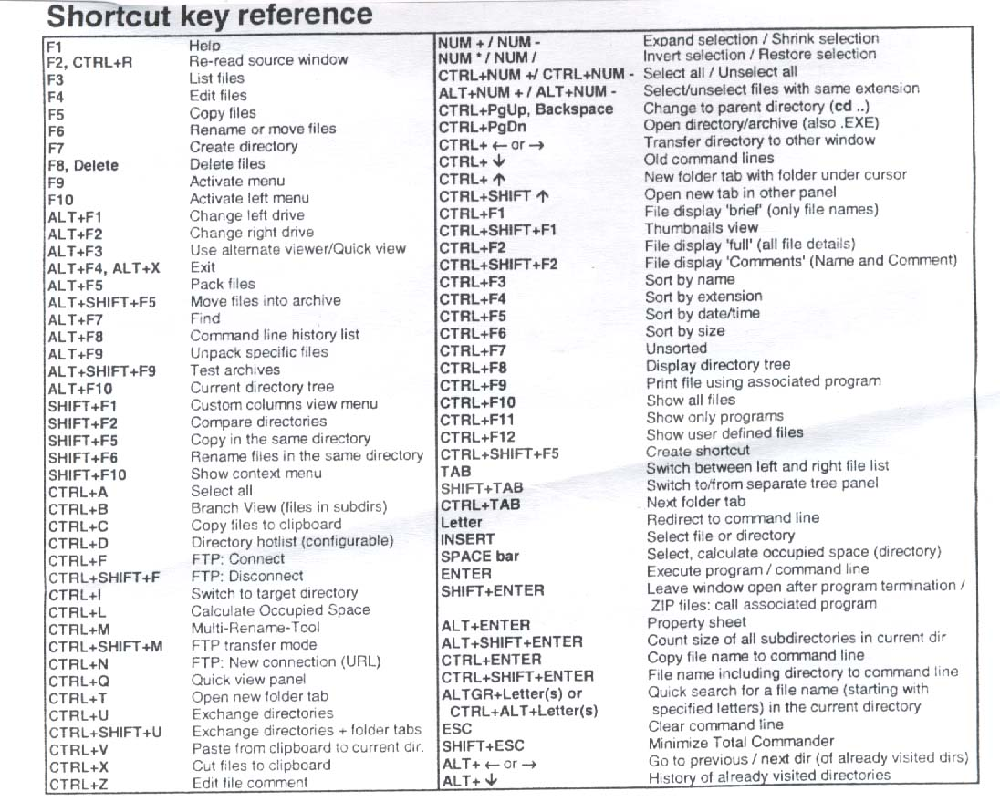

# Cheatsheets

A collection of cheatsheets.

* [Font Awesome](https://fortawesome.github.io/Font-Awesome/cheatsheet/)
* [SemVer calculator](http://semver.npmjs.com/)
* [Roadmap to becoming a web developer in 2017](https://github.com/kamranahmedse/developer-roadmap#-front-end-roadmap)

## ASCII

## BigO

[http://bigocheatsheet.com/](http://bigocheatsheet.com/)

## VIM

 

## .Net

[Core .Net PDF](https://github.com/hamxiaoz/notes/tree/9d65a28e8c0ebcdd1e2037fd60457da8edf05f03/Cheatsheets/core_dotnet.pdf)

## Total Commander

