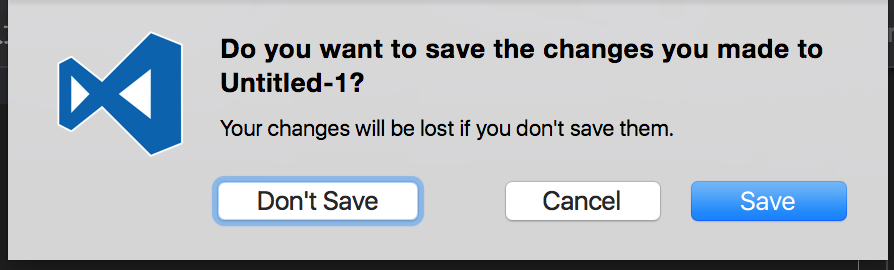

# Mac

## Hotkeys
- Jump to word: `ALT+arrow`
- Zoom in quick look: hold down `ALT/Option` (it seems you can zoom by guesture on El Capitan)

Enable `System Preferences > Keyboard -> Shortcuts: check All controls` then you can use `SPACE` to choose file dialog:

---

## Mac Development Tools

### Network
- inject data to web: http://www.charlesproxy.com/

### VM
- https://github.com/xdissent/ievms/